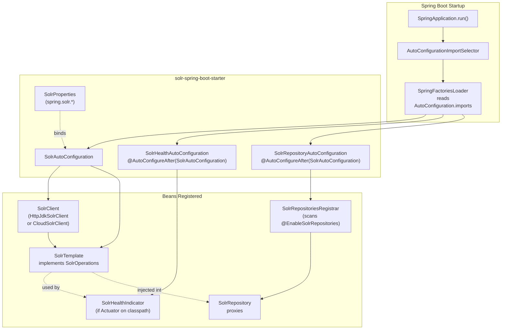
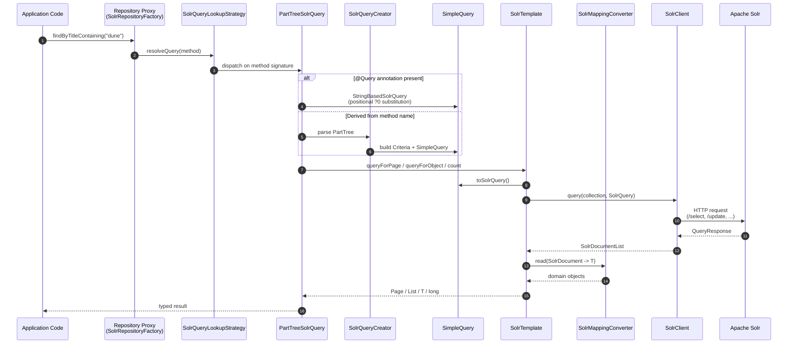
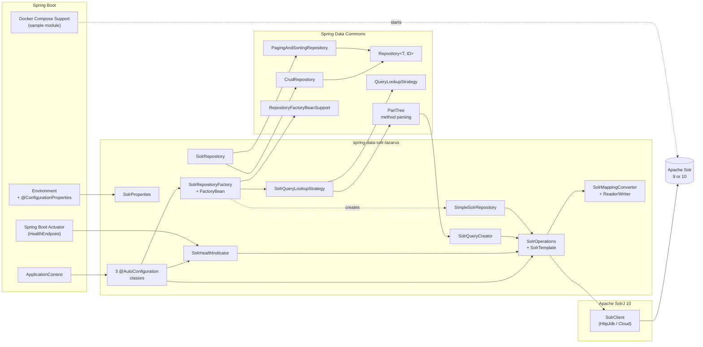
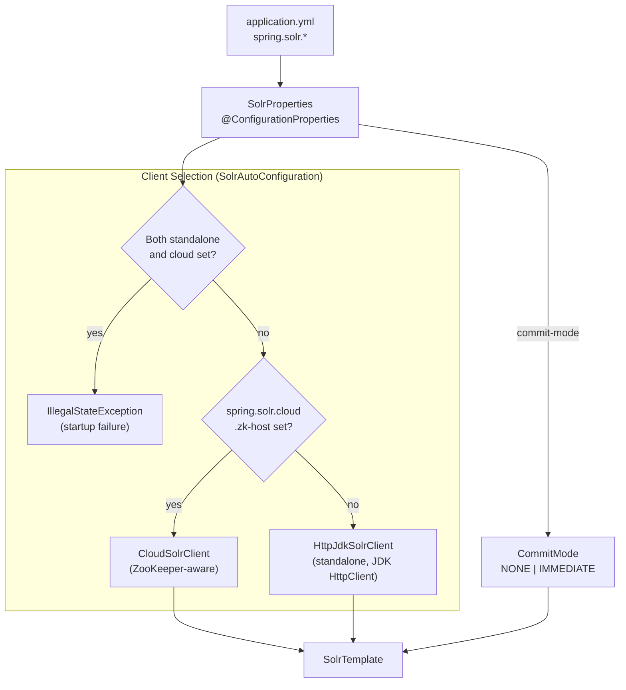

# Architecture Diagrams

Visual reference for how `spring-data-solr-lazarus` integrates with Spring Boot's
auto-configuration, Actuator, and Spring Data infrastructure. All diagrams are
Mermaid — render them in GitHub, IntelliJ, or any Markdown viewer with Mermaid
support.

---

## 1. Spring Boot Auto-Configuration Chain

How the starter wires itself into a Spring Boot application at startup. The
three `@AutoConfiguration` classes are registered via
`AutoConfiguration.imports` and pulled in by `SpringFactoriesLoader` during the
boot lifecycle.

---

## 2. Request Flow: Repository Call to Solr

What actually happens when application code calls a derived query method on a
`SolrRepository`. Spring Data's PartTree mechanism is the bridge between method
names and Solr query strings.

---

## 3. Spring Boot Middleware Integration

A higher-level view: which Spring Boot subsystems the library plugs into, and
which Spring Data contracts it implements. This is the "what touches what"
map.

---

## 4. Configuration Surface

Where the user's `application.yml` lands and which beans it shapes.

---

*"Make it so."* — render these wherever the docs are served; they should stay
in lock-step with the auto-configuration classes and the `SolrTemplate` /
`SolrRepository` contracts. Update when a new `@AutoConfiguration` class is
added or the request-flow pipeline changes shape.
